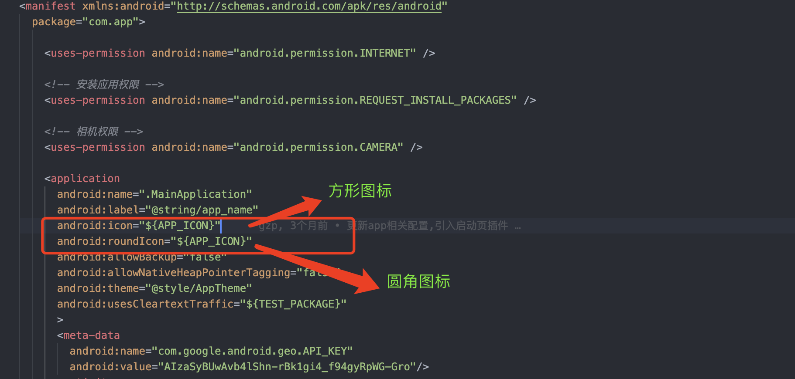
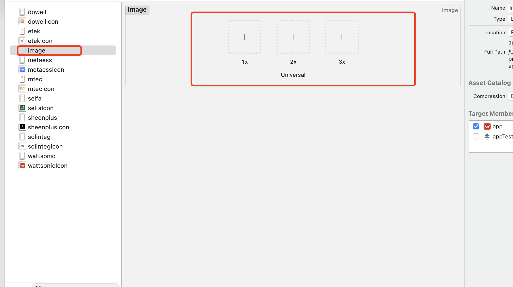

# ODM 打包配置

### 介绍
使用`.env`文件来控制android和iOS的一些原生配置,实现一份代码打包出不同版本的APP

### 依赖

> 使用此插件可以在原生代码中读取.env文件的值

`react-native-config` [配置参考](https://github.com/luggit/react-native-config)


### 配置信息
原生平台目前需要配置的信息如下:

`包名`

`名字`

`图标`

`版本号`

`构建版本号`

`启动页`

`是否允许http请求`


### 调试/打包
```js
//android 调试
// --appid 是为了metro可以正确找到这个activity,缺少此参数构建成功后将无法自动打开APP
// ENVFILE=.env.ODM 会在运行前加载对应的 .env.ODM文件,没有此命令将默认加载 .env文件内的内容
"android": "react-native run-android  --appId solinteg.cloud.app"
"android:ODM": "ENVFILE=.env.ODM react-native run-android --appId ODM_APP_ID"

// android打包
// apk
"android-apk": "cd android && ./gradlew assembleRelease"
"android-apk:ODM": "cd android && ENVFILE=.env.ODM  ./gradlew assembleRelease"
// aab
"android-aab": "cd android && ./gradlew bundleRelease"
"android-aab:ODM": "cd android && ENVFILE=.env.ODM  ./gradlew bundleRelease"

// iOS调试
// --scheme ODM 是采用对应的打包方案,iOS中每个scheme对应一个ODM,可在xcode中查看, --scheme 后边的值一般和ODM保持相同
// --simulator='iPhone 14' 指定要打开的模拟器型号,也可以设置其他型号
"ios": "react-native run-ios --simulator='iPhone 14'"
"ios:ODM": "ENVFILE=.env.ODM react-native run-ios --scheme ODM --simulator='iPhone 14'"

//iOS打包在xcode中进行
```

### 配置

#### adnroid 初次配置

##### 包名

`app/build.gradle` 中配置

> project.env.get("BUNDLE_ID") 获取.env文件中变量名为`BUNDLE_ID`的值

```java
  defaultConfig{
    //...
    applicationId project.env.get("BUNDLE_ID")
  }
```

##### 名字

`app/build.gradle` 中配置

> 下边代码将会在编译阶段在`app/src/main/res/values/strings.xml` 文件中生成一个 `<string>` 标签,他有一个name属性,值为 `app_name` 标签的内容为 project.env.get("APP_NAME")的值
>
> 类似于 `<string name="app_name">APP_NAME</string>`
>
> 这个标签的值决定了打包后APP的名字

```java
defaultConfig{
  //...
  resValue "string", "app_name", project.env.get("APP_NAME") 
}
```

##### 图标

1. 生成不同分辨率的图标,可以通过这个[网站](https://icon.wuruihong.com/#)
2. 将图标放入对应的分辨率文件夹中 `app/src/main/res/mipmap-xxx`
3. `app/build.gradle`中声明变量
```java
  defaultConfig{
    //...
    //生成在 AndroidManifest.xml中可以访问的变量,多个值用 "," 隔开
    manifestPlaceholders=[APP_ICON:project.env.get("APP_ICON")]

    //AndroidManifest.xml 中  ${APP_ICON} 即可访问
  }
```
4. 在`app/src/main/AndroidManifest.xml`中使用变量
  
   
   
##### 版本号 和 构建版本号
`app/build.gradle`中配置
```java
defaultConfig{
  //...
  //构建版本号,toInteger()将变量值转为整数类型,.env文件中所有变量的值都是字符串类型
  versionCode project.env.get("VERSION_CODE").toInteger() 
  // 版本号
  versionName project.env.get("VERSION_NAME") 
}
```
##### 启动页
1. 准备启动页图片,推荐2倍图一张放入`app/src/main/res/drawble`文件夹下,图片的名字要和 `SPLASH_SCREEN` 变量分隔符后边保持一致,比如 SPLASH_SCREEN 变量的值为 `@drawable/wattsonic_screen`,那图片的名字就是 `wattsonic_screen`
2. 在`app/build.gradle`中配置
```java
  defaultConfig{
    //...
    resValue "string", "splash_screen", project.env.get("SPLASH_SCREEN")
  }
```
3. 在`app/src/main/res/layout/launch_screen.xml`文件中主动去读取,添加`@string/splash_screen`至以下代码中(相当于获取**strings.xml**文件中**name="splash_screen"**的标签的值)


##### 是否允许http请求
使用两份配置文件 `app/src/main/res/xml/network_config_http.xml` 和 `app/src/main/res/xml/network_config_https.xml`,然后根据环境变量来选择对应的配置文件
1. 在`app/build.gradle`中声明变量
```java
  defaultConfig{
    //...
    // 判断 TEST_PACKAGE 变量的值来选择对应的 配置文件
    manifestPlaceholders=[TEST_PACKAGE:project.env.get('TEST_PACKAGE') == 'false'?'@xml/network_config_https' : '@xml/network_config_http']
  }
```
2. 在app/src/main/AndroidManifest.xml中使用变量


> 还可以在`app/src/main/res/xml/network_config_https.xml`文件中配置http域名的白名单


##### 结束
至此,android原生代码里边需要配置的信息已经处理完成,后续通过package.json文件中的命令,便可以调试/打包相关的DOM

#### android 后续新增ODM
新增ODM 不需要太多的流程
1. 准备ODM的 app图标,放入`app/src/main/res/mipmap-xxx`文件下
2. 准备ODM的 启动页图片,放入`app/src/main/res/drawble`文件下
3. 准备对应的.env.ODM 文件,配置对应的环境变量值
4. 在package.json中配置对应的打包/调试命令,参考`调试/打包`模块

结束

#### iOS初次配置
iOS的配置基本上都在xcode中进行,思路就是每一个ODM对应一个`scheme`,通过切换不同的`scheme`来读取不同的.env文件,来达到效果

##### react-native-config 配置

iOS不能直接读取.env文件中的变量,需要先通过一些配置,将这些变量复制到xcode中,使其可以在xcode中访问.

> 每次编译前react-native-config 会将对应.env文件中的值复制到`ios/tmp.xcconfig`文件中(如果没有会创建此文件),然后通过第一步新建的文件将这些值作为xcode的环境变量来使用,可以在`TARGETS -> Build Settings -> User-Defined` 查看
1. 单击文件树并创建 XCConfig 类型的新文件


2. 将以下代码复制到新建的文件下
``` java
  #include? "tmp.xcconfig"
```
3. 将以下内容添加到根目录的“.gitignore”：
```java
  # react-native-config codegen
  ios/tmp.xcconfig
```
4. 前往`PROJECT -> info` 中应用配置,选中第一步新建的文件
  

5. 修改`Scheme`,将以下代码复制到新建的shell脚本中
> 下边脚本的大概意思就是,将字符串 '.env' 写入到电脑 tmp/envfile 文件下,如果没有此文件会创建此文件 可以在终端 通过 `cat /tmp/envfile` 查看
> 然后执行 react-native-config 的脚本,他会根据 `tmp/envfile`的值将对应.env文件中的变量写入到 tmp.xcconfig 文件里,方便iOS读取
 
```sh
  echo ".env" > /tmp/envfile
  touch "${PROJECT_DIR}/../node_modules/react-native-config/ios/ReactNativeConfig/BuildDotenvConfig.rb"
  "${SRCROOT}/../node_modules/react-native-config/ios/ReactNativeConfig/BuildXCConfig.rb" "${SRCROOT}/.." "${SRCROOT}/tmp.xcconfig"
```


完成以上步骤便可以在xcdoe中使用.env文件中的变量了

##### 包名

1. 转到 `TARGETS -> Build Settings` 
2. 右上角搜索 `identifier`,找到 `Product Bundle Identifier` 
3. 双击右侧,修改值为`$(BUNDLE_ID)`,回车确定,此时右侧的内容应该已经变成对应的env文件中的 `BUNDLE_ID的值`,而不是显示为`$(BUNDLE_ID)`


##### 版本号/构建版本号
1. 转到 `TARGETS -> Build Settings` 
2. 右上角搜索 `Versioning`
3. 修改构建版本号,找到`Current Project Version`,双击右侧,修改值为$(VERSION_CODE)
4. 修改版本号,找到`Marketing Version`,双击右侧,修改值为$(VERSION_NAME)


##### 图标
1. 准备 1024*1024 分辨率的图标
2. 点击左侧 `images.xcassets`,右键空白区域,创建APP图标文件,文件名字要和`APP_ICON_IOS`保持一致
3. 拖入图标
4. 转到`TARGETS -> Build Settings`
5. 右上角搜索`icon`,找到`Primary Aaa Icon Set Name`
6. 双击右侧,修改值为`$(APP_ICON_IOS)`


##### 启动屏
1. 准备二倍图一张
2. 点击`images.xcassets`,右键空白区域,创建AP启动屏文件.
3. xcode右侧选择要兼容的系统,默认有iOS6+(包括iOS8+的横屏启动页)
4. 放入图片,同一张图片放入三次即可,暂时没考虑太多分辨率的图片
5. 新建 **.storyboard文件**,右键项目选择new file,文件名字要和.env文件中的`SPLASH_SCREEN_IOS`的值保持一致
6. 选中新建的 **.storyboard文件**文件,点击右上角+,搜索 imgae,把 imgaeView拖拽到 View目录下
7. 选中新创建的imgae,右侧选中第二步创建的imgae文件,然后调整大小/布局.
8. 点击`info.plist`文件,找到 `Launch screen interface file base name` 双击右侧,修改值为`$(SPLASH_SCREEN_IOS)`
   




##### 是否允许http请求
iOS是否允许http请求是通过`info.plist`文件中`App Transport Security Settings`下的`Allow Arbitrary Loads`属性的值来控制的,因为这个属性的值是一个`Boolean`类型的,而.env文件中的值都是`String`类型,所以无法作为`Allow Arbitrary Loads`属性的值.

所以目前采用暴力的方法来实现此配置:
思路就是,在xcode构建前,使用shell脚本来根据`TEST_PACKAGE`变量的值来`读取并修改info.plist`文件中的内容
1. 转到`Edit Scheme`,在`react-native-config`的配置后边添加以下代码即可

> 下边代码会找到info.plist文件,并且根据变量值来修改文件内容
```sh
# iOS环境变量的文件路径
configFile="${SRCROOT}/tmp.xcconfig" 

# 1.获取 "TEST_PACKAGE=true" 在文件中的行号(获取不到位空)
function get_line1() { 
  grep -n "TEST_PACKAGE=true" $configFile | cut -d ":" -f 1
}
configLine=$(get_line1) # 行号

# 2.获取到info.plist中需要修改的行号
plistName="${SRCROOT}/app/info.plist"
function get_line2() {
  grep -n "NSAllowsArbitraryLoads" $plistName | cut -d ":" -f 1
}
line=$(get_line2) # 行号 字符串类型

# 将行号转为数字类型并且加一
newLine=`expr $line + 1`

# 3.判断 TEST_PACKAGE = true 是否存在
if [ $configLine ];
then
sed -i '' "${newLine}s/false/true/" $plistName
else
sed -i '' "${newLine}s/true/false/" $plistName
fi

# 结束
```


#### iOS后续新增ODM
1. 配置对应的.env.ODM文件
2. 准备APP图标,步骤参考`图标的1-3步骤`
3. 准备启动屏,步骤参考`启动屏的1-7步骤`
4. 新增`Scheme`,修改为对应的ODM即可


