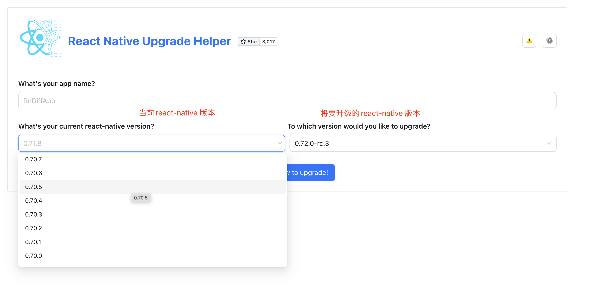
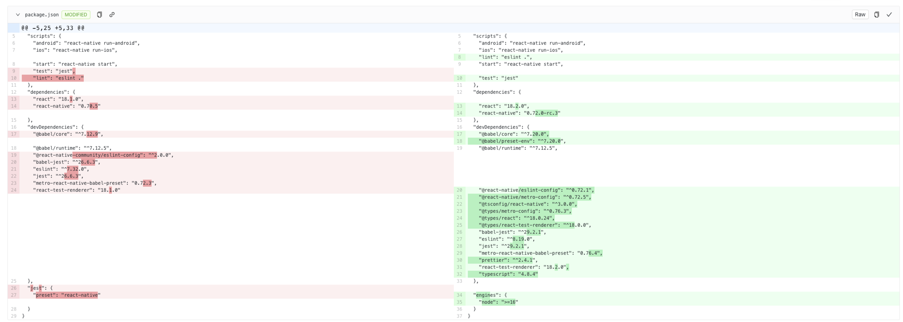
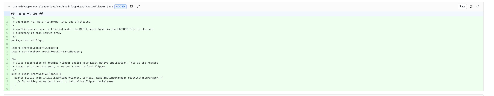
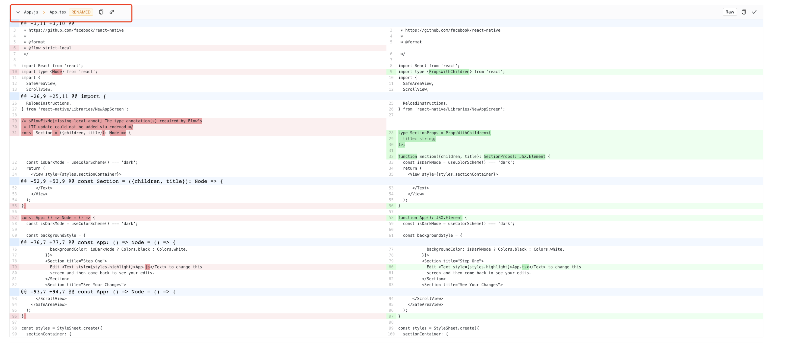
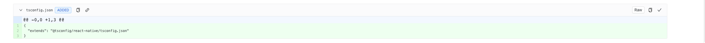
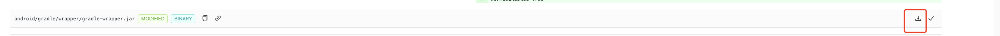
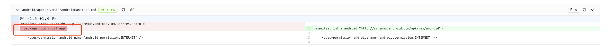

# React Native 升级

## 开始
react-native 的升级不能单单通过修改`package.json`的版本号来升级,因为涉及到`/android` 和 `/ios` 以及根目录的一些配置文件的修改,所以需要一些额外步骤来辅助升级.

### 使用 [升级助手](https://react-native-community.github.io/upgrade-helper/) 对比两个版本之间的差异

1. 选择`当前版本`和`将要升级的版本`,点击`show me how to upgrade!`按钮,显示两个版本之间文件的差异
   
2. 根据差异进行修改,比如:
   1. 文件内容变更,对比差异直接修改即可
    

   2. 文件删除,删除文件即可
    

   3. 文件新增,根据路径新增文件即可
    
    
   4. 文件名修改,修改对应文件名称,内容根据情况修改
    > 不是所有文件一定要按照差异修改,就比如这个 `app.tsx`文件,内容都是**初始项目模板**的内容,我们完全没有修改的必要,甚至文件名字不修改也完全没有问题
    

    包括这个`tsconfig.json`文件,因为我们项目创建的时候 react-native 对 typescript 还不是默认支持的(react-native 0.71开始默认支持ts的),我们使用的是社区包含typescript的模板来创建的项目,所以,下边的改动其实和我们项目的`tsconfig.json`文件的内容一样,就不需要再改动了 **(如果文件内容不一样了还是要考虑改动的)**
    

    5. 如果遇到一些压缩包内容的改动,比如`.jar`这种的,直接点击右侧的下载,把下载后的`.jar`文件直接替换我们项目原有的`.jar`文件即可
    

> 补充,差异对比过程中,遇到`rndiffapp`这种的字样指的是我们项目的名称(app),比如这里的`com.rndiffapp` 指的就是 `com.app`
> 

### 完成以上步骤后,重新 `npm install 或者 yarn` 即可,还有`pod install`

### react-native的升级总会有些破坏较大的地方,可能会造成项目内第三方插件报错的问题,升级前需要慎重考虑,升级后需要多做测试