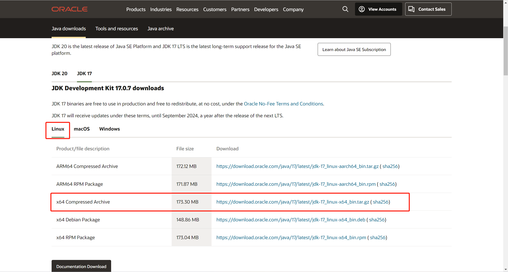
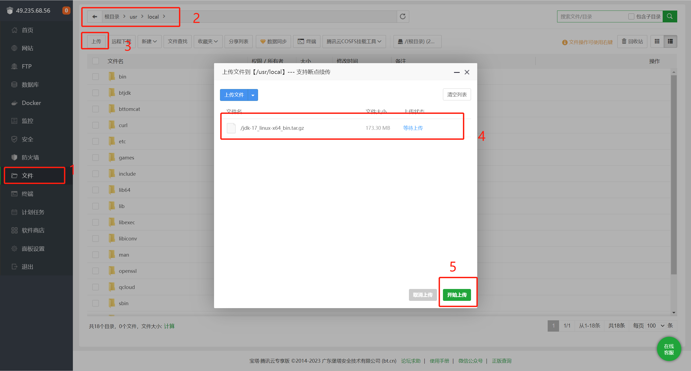
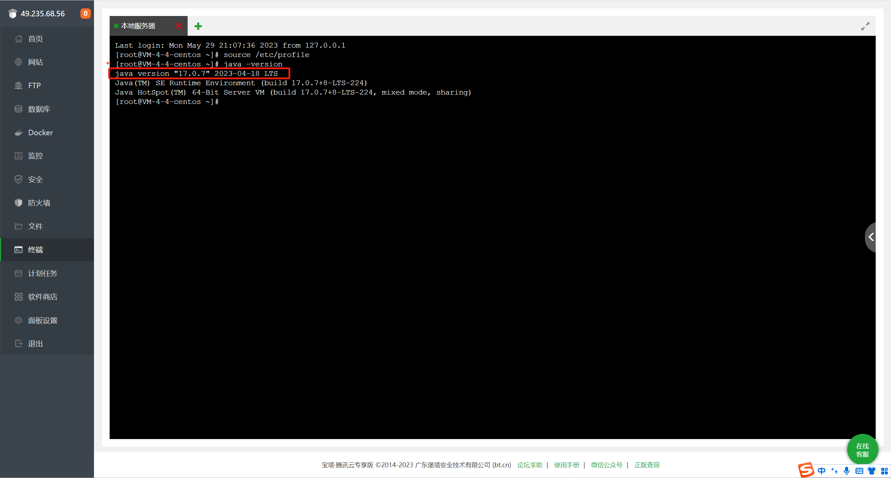

# 自动化部署(windows)

## 目标
使用 `jenkins` 对本项目进行自动化部署

> Jenkins是一个开源的跨平台持续集成工具，它提供了GUI界面以及大量的拓展插件，通过GUI界面可以简单、快速的完成项目持续集成配置，更重要的是Jenkins支持所有的版本控制工具。

-  [中文文档](https://www.jenkins.io/zh/doc/)


## 安装Jenkins

::: info
原本打算安装在电脑上使用的,后来发现安装到电脑上的jenkins为了保证`jenkins`的可访问性需要保证电脑一直运行服务,不太方便,所以决定将其安装在服务器上,方便从其他设备访问.

ps: 因为我的个人服务器是通过`宝塔面板`来管理的,所以本次以宝塔面板为例
::: 

### 配置宝塔面板

- 安装jdk
  - jenkins的运行需要java环境的支持,所以需要安装[JDK(Linux版本)](https://www.oracle.com/java/technologies/downloads/#java17)到宝塔面板中.
  - 
  - 将下载好的压缩包上传到宝塔面板
  - 
  - 上传完成后解压到/usr/local/java文件夹在下(java文件夹需要手动创建)
  - 解压后需要配置环境变量
      - 双击`/etc/profile`文件,复制下边代码到`profile`文件中,保存后退出
      - ```sh
        export JAVA_HOME=/usr/local/java/jdk-17.0.7 # 这里的路径是你解压后jdk的文件路径 
        export JRE_HOME=${JAVA_HOME}/jre
        export CLASSPATH=.:${JAVA_HOME}/lib:${JRE_HOME}/lib
        export PATH=${JAVA_HOME}/bin:$PATH
         ```
      - 然后打开终端查看java版本是否成功显示
      - ```sh
        source /etc/profile # 重新加载配置文件
        java -version # 查看java版本
        ```
      - 
      - 如上图所示便配置成功

### 下载Jenkins
官网下载最新版war包[地址](https://www.jenkins.io/zh/doc/book/installing/#war%E6%96%87%E4%BB%B6)