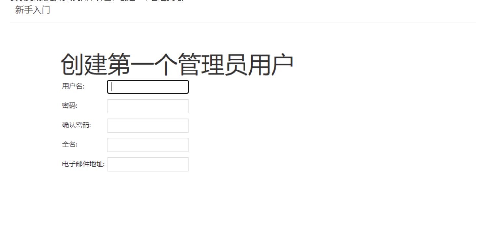

# 自动化部署

## 目标
使用 `jenkins` 对本项目进行自动化部署

> Jenkins是一个开源的跨平台持续集成工具，它提供了GUI界面以及大量的拓展插件，通过GUI界面可以简单、快速的完成项目持续集成配置，更重要的是Jenkins支持所有的版本控制工具。

-  [中文文档](https://www.jenkins.io/zh/doc/)

### 思路
每次本地提交代码到`master`分支的时候,利用github的`webhooks`功能,向`jenkins`发送一个网络请求通知jenkins执行自动化流程(拉代码,打包,部署)

### 步骤

::: info
原本打算安装在电脑上使用的,后来发现安装到电脑上的jenkins为了保证`jenkins`的可访问性需要保证电脑一直运行服务,不太方便,所以决定将其安装在服务器上,方便从其他设备访问.

ps: 因为我的个人服务器是通过`宝塔面板`来管理的,所以本次以宝塔面板为例
::: 


- 配置宝塔面板环境
  - jdk
  - node
  - jenkins
    - 配置github  
    - 配置jenkins


## 宝塔面板环境配置

因为jenkins需要java环境来运行,所以需要在服务器上安装`JDK`,并且后续再配置jenkins过程中还要用到node相关的东西,所以还需要在服务器上安装`nodejs`,并且配置好`JDK`和`nodejs`的环境变量  

### 安装JDK

1. 安装jdk
   - [下载JDK(Linux版本)](https://www.oracle.com/java/technologies/downloads/#java17).
   - 
   - 将下载好的压缩包上传到宝塔面板
   - 
   - 上传完成后解压到/usr/local/java文件夹在下(java文件夹需要手动创建)
   - 解压后需要配置环境变量
      - 双击`根目录/etc/profile`文件,复制下边代码到`profile`文件中,保存后退出
      - ```sh
        export JAVA_HOME=/usr/local/java/jdk-17.0.7 # 这里的路径是你解压后jdk的文件路径 
        export JRE_HOME=${JAVA_HOME}/jre
        export CLASSPATH=.:${JAVA_HOME}/lib:${JRE_HOME}/lib
        export PATH=${JAVA_HOME}/bin:$PATH
         ```
      - 然后打开终端查看java版本是否成功显示
      - ```sh
        source /etc/profile # 重新加载配置文件
        java -version # 查看java版本
        ```
      - 
      - 如上图所示便配置成功

### 安装node
宝塔面板默认安装了node,就不用再次安装了

### 安装jenkins

1. [下载最新的 jenkins WAR包](https://www.jenkins.io/zh/doc/book/installing/#war%E6%96%87%E4%BB%B6)
2. 在宝塔面板上传刚刚下载的war包
3. 创建项目,项目路径选择刚刚上传的war包路径
  
4. 启动项目后,浏览器输入地址+端口,正常访问即成功

### 配置jenkins
---

#### 初始化配置
1. 正常访问后要初始化配置,首先解锁 jenkins,根据提示路径获取密码
2. 安装插件,一般选择`推荐插件`
3. 安装完成后创建一个管理员账户方便下次登录
   
   
   

#### github配置
初始化配置完成后,我们可以先去github配置下`webhooks`和`api令牌`方便后续jenkins配置
- 转到需要自动化打包的项目,点击`settings`->`webhooks`,添加地址后保存,地址是ip+端口+/github-webhook/
  
- 转到个人设置里配置api令牌,`settings`->` Developer settings`,新增api令牌,输入名称,勾选下边两个选项保存即可
- 创建成功后复制这段私钥,后边添加凭证时会用到
  
  
  

#### 凭证添加
- 登录凭证

因为我们后续要使用jenkins自动去远端拉取/推送代码,所以我们要配置好远端的登录凭证,国内github不太稳定,所以本次采用`SSH`来验证

`系统管理`->`credentials`->`全局`


- api令牌凭证
- `系统管理`->`credentials`->`全局`
- 步骤和`登录凭证一样`,只有类型上有些区别


#### 环境变量配置
这一步要把 `java`和`nodejs`的环境变量添加到jenkins中,使得jenkins中的一些脚本能够正常运行

1. 获取环境变量,进入宝塔面板打开终端输入`echo $PATH` 复制环境变量


2. jenkins主页点击 `系统管理`->`Configure System`,找到**全局属性** 新增环境变量


#### github服务配置
1. `系统管理`->`Configure System`,找到`Github`,添加github服务器,选择之前创建的api令牌凭证


### 创建自动化任务
jenkins首页点击新建


### 结束
完成以上步骤即可完成需求
   
   


